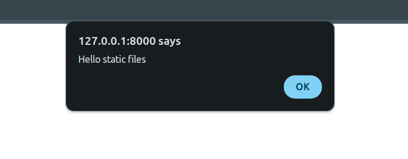

# Hiding the "Nothing to see" message 

To get this part right, we're going to use some perfectly normal JavaScript.

Step 1 is to make a javascript file and update index.html so it knows about it.

Make a new directory inside your app and name it `static`. Then inside that, make another directory with the name of your app. Inside that new directory, make a file. Call it `utils.js`.

This weirdness should feel pretty familiar. It's a similar pattern to what you did with the templates directory:

```
│   ├── static
│   │   └── todos
│   │       └── utils.js
│   ├── templates
│   │   └── todos
│   │       ├── index.html
│   │       └── partial_todo_item.html
```

Inside utils.js do the following:

```
alert("Hello static files")
```

Now, let's edit index.html.

Add this to the very top of your index.html file:

```

```

Then, in the head of the document, add another script tag:

```
<script src=""></script>
```

Now, when you reload the page you should get an alert. If it's not coming through then triple check that you named everything correctly and restart the development server.



## The Javascript 

If there are items on display, then the "Nothing to see" message should be hidden.

If there are no items then the message should be visible.

Here is some pseudocode:

```
if there are items on the page:
    hide the message 
else 
    show the message
```

In order to do this in JavaScript, we will need to be able to select the correct dom elements.

Open up index.html and update the div that contains the message by giving it an id. We'll need that so we can interact with it.

Mine now looks like this:

```
<div class="text-center text-2xl font-bold text-transparent/30 pt-6" id="todo_items_empty">
    Nothing to see here...
</div>
```

Next, go into your partial template and give it a class. Mine looks like this:

```
<div class="todo_item">
    <input type="checkbox" />
    {{ item.title }}
    <button>
        Delete
    </button>
</div>
```

Now, in utils.js: 

Start off by deleting the alert. 

Then put this in:

```
function showOrHideEmptyMessage() {
    // use the id and class name you just set up
    const itemClass = "todo_item" 
    const emptyListId = "todo_items_empty"

    const itemCount = Array.from(document.getElementsByClassName(itemClass)).length;

    if (itemCount === 0) {
        document.getElementById(emptyListId).style.display = "block";
    } else {
        document.getElementById(emptyListId).style.display = "none";
    }
}
```

The next thing we need to do is make sure that this function gets called every time the div containing the items gets updated.


Add this to your utils.js file:

```
window.onload = function () {
    // note the ID here. It is the target from our form's htmx post
    const targetNode = document.getElementById("todo_items");

    const config = {
        childList: true,
    };

    const observer = new MutationObserver(showOrHideEmptyMessage);
    // we are watching mutations here so that the same code will work
    // when we add and delete items 

    observer.observe(targetNode, config);
};
```

Re-run your tests and make sure they all pass.

## Pure HTMX approach 

There is more than one way to achieve the same functionality. We approached this with JavaScript, but we can get the code to work by using pure HTMX.

The way to do it would be to rerender the entire todo item list every time the form is submitted. So, instead of simply appending an item to the `todo_items` div, the whole div would be re-rendered. 

The "Nothing to see" message would then be placed inside that div. It would only be rendered if there were no items to display. 

This way of doing things is much simpler to reason about - we simply re-render a part of the page. But it can lead to a lot of extra network traffic if that part of the page is big. It's useful to consider the tradeoffs of different approaches. 

