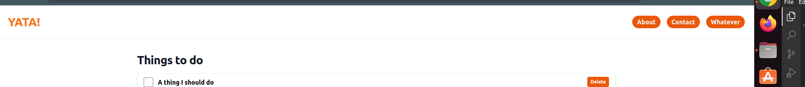
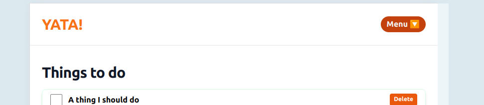

# Responsive header bar with Tailwind and AlpineJS

It is quite common for web applications to have header bars with links in them. On a large screen, those links can all be made visible to the user. On smaller devices it is useful to have the links available inside a menu.

Here are 2 websites that demonstrate the above:

- https://guildofeducators.com/
- https://www.sheenaoc.com/

For each of these sites: 

1. Find the header area and the links
2. Open up the dev-tools in your browser and see what happens if you look at the site through a smaller device
3. Can you see the menu button? Can you still access what you need to access? 

## Let's add a header 

We'll start simple by adding a header area to our site. It will have a few basic links on it, and those links will show up along the top of the screen.

Nothing fancy at this point. It will be a rectangle with links in it, that's all.

We can use Tailwind to make it look kinda nice.

Go to your index.html file add add a header area just inside your body tag. Something like this:

```
...
</head>

<body hx-headers='{"X-CSRFToken": "{{ csrf_token }}"}'>

    <div class="flex items-center justify-between p-6 border-b mb-5">
        <a href="/" class="text-orange-500 font-bold text-3xl">YATA!</a>
        <nav class="gap-x-4 flex">

            <a href="#"
                class="bg-orange-600 hover:bg-orange-700 text-gray-100 font-bold rounded-full pt-1 pb-1 pl-3 pr-3">About</a>
            <a href="#"
                class="bg-orange-600 hover:bg-orange-700 text-gray-100 font-bold rounded-full pt-1 pb-1 pl-3 pr-3">Contact</a>
            <a href="#"
                class="bg-orange-600 hover:bg-orange-700 text-gray-100 font-bold rounded-full pt-1 pb-1 pl-3 pr-3">Whatever</a>
        </nav>
    </div>


...
```

Take a moment to style it how you want to.

You'll end up with something like this:




## Adding responsiveness 

When users access this page using a large screen, they should see all the menu items lined up. When they use a smaller screen, they should see a menu button. Let's get that done:

We'll wrap the `nav` element in a div with the class `hidden lg:block`. This means that on small screens the nav will be hidden, but on large screens it will be shown. 

We will then add another div underneath it with the class `block lg:hidden`. This one will be displayed by default, but hidden on larger screens. Inside this second div, add a `button` element and make it clear that it is for expanding the menu.

At this point, the entire header code looks like:

```
    <div class="flex items-center justify-between p-6 border-b mb-5">
        <a href="/" class="text-orange-500 font-bold text-3xl">YATA!</a>
        <div class="hidden lg:block">

            <nav class="gap-x-4 flex">

                <a href="#"
                    class="bg-orange-600 hover:bg-orange-700 text-gray-100 font-bold rounded-full pt-1 pb-1 pl-3 pr-3">About</a>
                <a href="#"
                    class="bg-orange-600 hover:bg-orange-700 text-gray-100 font-bold rounded-full pt-1 pb-1 pl-3 pr-3">Contact</a>
                <a href="#"
                    class="bg-orange-600 hover:bg-orange-700 text-gray-100 font-bold rounded-full pt-1 pb-1 pl-3 pr-3">Whatever</a>
            </nav>
        </div>

        <div class="block lg:hidden">
            <button
                class="bg-orange-600 hover:bg-orange-700 text-gray-100 font-bold rounded-full pt-1 pb-1 pl-3 pr-3">Menu
                🔽</button>
        </div>

    </div>
```

Take a moment to look at your website. Do the correct elements show and hide as they need to as you change the screen size?

On smaller screens it should look like:



## Hello Alpine.JS

The next thing we will do is make use of Alpine.js to make the menu button do something. 

First, go to the `head` of your html file and add this:

```
<script src="//unpkg.com/alpinejs" defer></script>
```

Now Alpine will be available in your page.

If you look at the [Alpine website](https://alpinejs.dev/) you'll see a small example that shows how to "open" or "expand" an element. We'll be borrowing from that.

We will need to:

1. create a variable called `open`
2. The menu button should be able to set `open` to true or false as needed
3. When `open` is true, then the links should be shown 

## Implementation 

The "menu" button is inside a div that is only shown on smaller screens. We need `open to be defined within the scope of that div.

Update the div to look like:

```
<div class="block lg:hidden" x-data="{ open: true }">
```

NOTE: In Python, boolean values are named `True` and `False`. In Javascript they are named `true` and `false`. We need to use the Javascript names for things here.

NOTE: We are stating off by setting `open` to `true`. This is a nice way to start because it makes it easier for us to see how the menu looks while we are building it. Once we are happy with the looks we can update the default value so that it starts off closed.

The next thing we need to do is get the button wired up. Add an `@click` attribute to the menu button like so:

```
<button @click="open = ! open" ...
```

Now the last step: we need to get the menu to look like a menu. 

Create a new div underneath the button, and put your navigation in there:

```
<div x-show="open">

    <nav>
        <a href="#">About</a>
        <a href="#">Contact</a>
        <a href="#">Whatever</a>
    </nav>
</div>
```

Now look at your page. Click the button a few times. Is it showing and hiding as expected?

## Style 

You can now add some tailwind styling to your menu. Play around a bit. 

Once you are happy with how things look, remember to update this line:

```
<div class="block lg:hidden" x-data="{ open: true }">
```

The default value should be `false` and not `true`.

Here is a full example for reference.

```
<div class="block lg:hidden" x-data="{ open: false }">
    <button @click="open = ! open"
        class="bg-orange-600 hover:bg-orange-700 text-gray-100 font-bold rounded-full pt-1 pb-1 pl-3 pr-3">Menu
        🔽</button>

    <div x-show="open" class="fixed z-10 right-5 bg-white border shadow-lg rounded-lg p-2">

        <nav class="flex flex-col text-left gap-2">

            <a href="#" class="text-gray-700 font-bold rounded-full pt-1 pb-1 pl-3 pr-3">About</a>
            <a href="#" class="text-gray-700 font-bold rounded-full pt-1 pb-1 pl-3 pr-3">Contact</a>
            <a href="#" class="text-gray-700 font-bold rounded-full pt-1 pb-1 pl-3 pr-3">Whatever</a>
        </nav>
    </div>
</div>
```

## Challenge yourself 

Here are a few things you can do to push your knowledge a little further:

1. See if you can get the menu button to look different depending on whether the menu is open or closed. Maybe use up and down arrows, or change the text on the button, or use icons. 

2. See if you can find a way to make the navigation more DRY. Every menu link is repeated in the template and that is a pain! Can you put the menu items in a data structure and loop over it? Where should you put the data structure?

